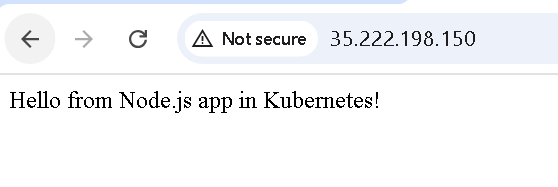
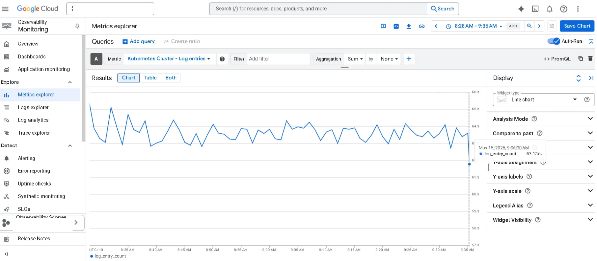
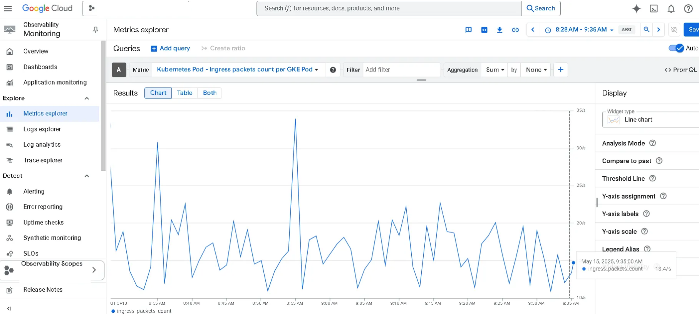
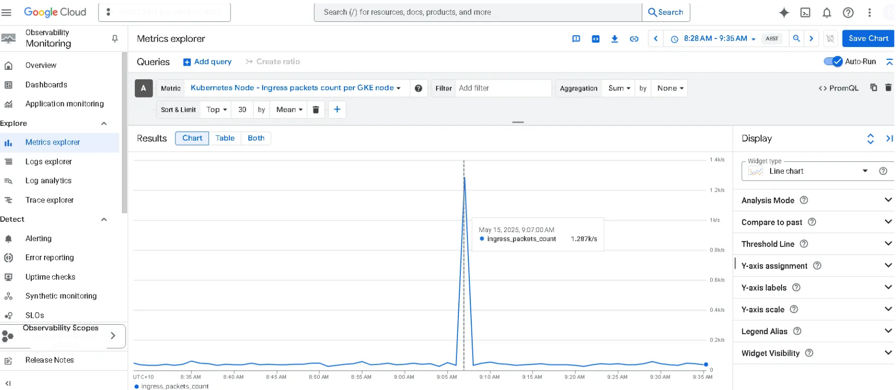

# 10.1P: Monitoring and Visibility

**Monitoring a Node.js App on GKE with DockerHub and Metrics Explorer**

This guide demonstrates how to containerise a simple Node.js application, deploy it to Google Kubernetes Engine (GKE), and monitor it using GCP’s Metrics Explorer.

### Tools Used

- **Node.js** – JavaScript runtime for building the app
- **Express.js** – Lightweight web server framework
- **Docker** – To containerize the Node.js app
- **DockerHub** – For hosting the Docker image
- **Kubernetes (GKE)** – To orchestrate and run the container in a managed cluster
- **kubectl** – CLI to interact with the Kubernetes cluster
- **GCP Metrics Explorer** – For monitoring logs, CPU/memory usage, and network traffic
- **Google Cloud Console** – To access project settings, Monitoring, and Kubernetes Engine

---

### 1. Build a Simple Node.js App

Create a `server.js` file:

```jsx
const express = require("express");
const app = express();
const PORT = process.env.PORT || 8080;

app.get("/", (req, res) => res.send("Hello from Node.js app in Kubernetes!"));

app.listen(PORT, () => console.log(`Server running on port ${PORT}`));
```

Initialise the project and install dependencies:

```bash
npm init -y
npm install express
```

---

### 2. Dockerise the App

Create a `Dockerfile`:

```docker
# Use official Node.js version 18 image
FROM node:18

# Set working directory inside the container
WORKDIR /usr/src/app

# Copy package files first to install dependencies
COPY package*.json ./

# Install app dependencies
RUN npm install

# Copy all remaining source files
COPY . .

# Open port 8080 for the app
EXPOSE 8080

# Command to run the app
CMD [ "npm", "start" ]

```

Build and Test locally on the terminal:

```docker
docker build -t node-k8s-app .
docker run -p 8080:8080 node-k8s-app
```

---

### 3. Write Kubernetes Deployment & Service Files

These YAML files deploy your Node.js app to a Kubernetes cluster.

Create a `deployment.yaml` to deploy your app to K8s

```yaml
apiVersion: apps/v1
kind: Deployment
metadata:
  name: node-k8s-deployment
spec:
  replicas: 1
  selector:
    matchLabels:
      app: node-k8s-app
  template:
    metadata:
      labels:
        app: node-k8s-app
    spec:
      containers:
        - name: node-k8s-container
          image: <yourusername>/node-k8s-app:latest
          ports:
            - containerPort: 8080
```

`image: <yourusername>/node-k8s-app:latest`

Replace `yourusername` with your actual DockerHub username

**Explanation:**

- Deploys **1 replica** of your app.
- Pulls the Docker image from **DockerHub.**
- Opens **port 8080** inside the container.
- The label `app: node-k8s-app` is used to connect with the service.

Create a `service.yaml` to expose your app to the internet

```yaml
apiVersion: v1
kind: Service
metadata:
  name: node-k8s-service
spec:
  selector:
    app: node-k8s-app
  type: LoadBalancer
  ports:
    - protocol: TCP
      port: 80
      targetPort: 8080
```

**Explanation:**

- Makes the app **publicly accessible**.
- Uses the label `app: node-k8s-app` to find the right pod.
- Maps **external port 80** (used in browsers) to **container port 8080**.
- `LoadBalancer` creates an external IP address so your app is visible on the web.

---

### 4. Push Docker Image to DockerHub

> Switched from Google Artifact Registry to DockerHub due to GCP IAM permission issues.

Open Docker Desktop for local, and Dockerhub on website

**Push image to DockerHub:**

```bash
docker tag node-k8s-app yourusername/node-k8s-app:latest
docker push yourusername/node-k8s-app:latest
```

**Update image path in `deployment.yaml`, then redeploy:**

```bash
kubectl delete deployment node-k8s-deployment
kubectl apply -f deployment.yaml
```

---

### 5. Confirm Kubernetes Deployment

```yaml
kubectl get services
```

Example output:

```bash
$ kubectl get services
NAME               TYPE           CLUSTER-IP       EXTERNAL-IP      PORT(S)        AGE
kubernetes         ClusterIP      34.118.224.1     <none>           443/TCP        18h
node-k8s-service   LoadBalancer   34.118.234.150   35.222.198.150   80:32537/TCP   17h
```

Visit: `http://35.222.198.150`→ Should return: **Hello from Node.js app in Kubernetes!**



---

### 6. Monitoring Charts Summary

These charts were generated from **GCP Metrics Explorer** after deploying the Node.js app to the GKE cluster. They confirm that the app and Kubernetes cluster are running, handling network traffic, and generating logs.

**How to access:**

Go to **Google Cloud Console → Monitoring → Metrics Explorer**, then use filters to view metrics.

**Chart 1: Kubernetes Cluster - Log Entries**



- The consistent log generation shows that the application is running and interacting with Kubernetes services.
- Confirms observability is working, which is essential for debugging, health checks, and auditing activity within the cluster.

**Chart 2: Kubernetes Pod - Ingress Packets per Pod**



- The packet spikes prove that the pod is receiving network traffic from the LoadBalancer and user requests.
- Confirms live communication is established b**e**tween external users and the deployed app via the Kubernetes service.

**Chart 3: Kubernetes Node - Ingress Packets per Node**



- The spike in packets indicates that the Kubernetes node is accepting traffic, proving the infrastructure is routing requests as expected.
- Confirms that the app is visible externally, and the LoadBalancer correctly forwards traffic from the public IP to the node.

### Command-Line Monitoring Output

In case Metrics Explorer access is limited, you can retrieve basic performance data using `kubectl`:

```bash
$ kubectl top pods
NAME                                   CPU(cores)   MEMORY(bytes)
node-k8s-deployment-5db7bd7f56-fgb5s   1m           32Mi
```

```bash
$ kubectl top nodes
NAME                                        CPU(cores)   CPU(%)   MEMORY(bytes)   MEMORY(%)
gk3-node-k8s-cluster-pool-2-14c0976e-k9mk   236m         12%      2805Mi          47%
```

- Confirms that your pod and node are consuming expected CPU and memory.
- Useful when full GCP monitoring features are restricted.

---

### **7. Reflection**

**Issue 1: ImagePullBackOff Error (GCR Permission Denied)**

At first, I attempted to pull my Docker image from Google Artifact Registry (GCR), but encountered `ImagePullBackOff` due to **IAM permission restrictions** in the Deakin GCP project.

**Solution:**

I switched to using **DockerHub** instead.

- Tagged and pushed my image to DockerHub.
- Updated the `deployment.yaml` to use `image: yourusername/node-k8s-app:latest`.
- Re-applied the deployment using `kubectl`.

**Monitoring Challenge:**

- At first, metrics like `kubernetes.io/container/cpu/request_utilization` didn’t appear in **Metrics Explorer** due to limited permissions.
- As a workaround, I used `kubectl top pods` and `kubectl top nodes` for basic CPU and memory usage.
- Later, I can accessed higher-level metrics such as **log entries** and **network packets**, confirming my deployment was visible to GCP’s monitoring system.

---

### 8. Cleaning Up to Stop GCP Charges

**GKE does cost money** even if you're not actively using it, because it runs compute, storage, and load balancer resources in the background.

**What’s Being Charged:**

- Your **GKE cluster** (e.g., 1–3 nodes)
- The **external IP** created by the LoadBalancer
- **Container storage & logs** (minor cost)

**To Stop Charges Immediately:**

You can safely delete everything:

```bash
# Delete the app and service first (optional)
kubectl delete service node-k8s-service
kubectl delete deployment node-k8s-deployment
```

```bash
# Delete the whole cluster (stops all charges)
gcloud container clusters delete node-k8s-cluster --region=us-central1
```

Then confirm with `Y` when prompted.

Then check services again to ensure no LoadBalancer

```bash
kubectl get services
```

**Good Practice:**

- Always delete your GCP resources after testing.
- You can **recreate the cluster later** when continuing your work.
